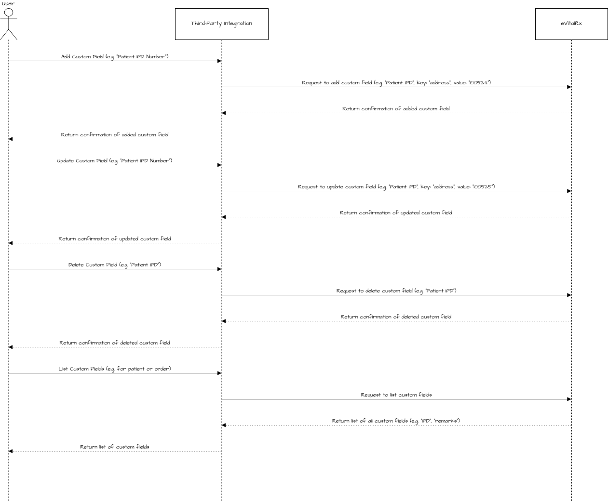

# Introduction

This API provides an entity to add custom fields with their attribute keys and value. Adding custom fields gives flexibility to the entity to store extra information related to an order or a patient.

**Here is the Postman Collection of APIs**



## Sequence Diagram

<figure><figcaption>
<mark style="background-color:yellow;"><strong><code>This sequence diagram illustrates how the Third Party interacts with eVitalRx for managing custom fields. It covers the operations of adding, updating, deleting, and listing custom fields for entities like orders or patients. The flow shows how the third party sends requests to eVitalRx, and eVitalRx responds with confirmation of actions performed.</code></strong></mark>
</figcaption></figure>

**Watch a video.**


