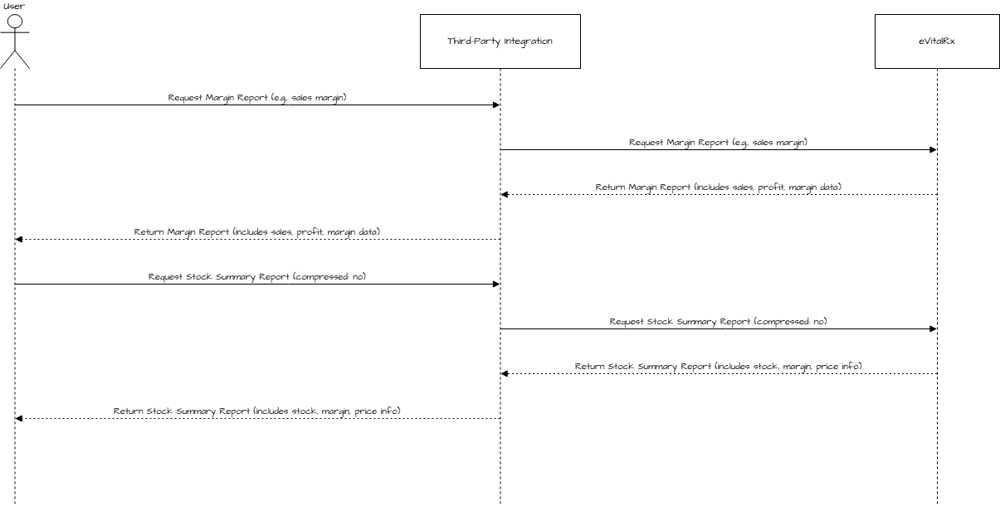

# Reports

The **Master Bundle API** provides two types of reports: the **Margin Report**, which details product margins, pricing, and related financial information, and the **Stock Summary Report**, which offers a comprehensive overview of stock levels, details, and product locations. Users can request these reports in either compressed or non-compressed formats, allowing for flexibility in data presentation and usage.

**Here is the Postman Collection of APIs**



## Sequence Diagram

<figure><figcaption>
<mark style="background-color:yellow;"><strong><code>The Master Bundle API offers two reports: the Margin Report, which provides product margins and sales data, and the Stock Summary Report, detailing stock levels, pricing, and margins. Users can request these reports from the eVitalRx System, which returns the data in either compressed or non-compressed formats.</code></strong></mark>
</figcaption></figure>

**Watch a video.**


