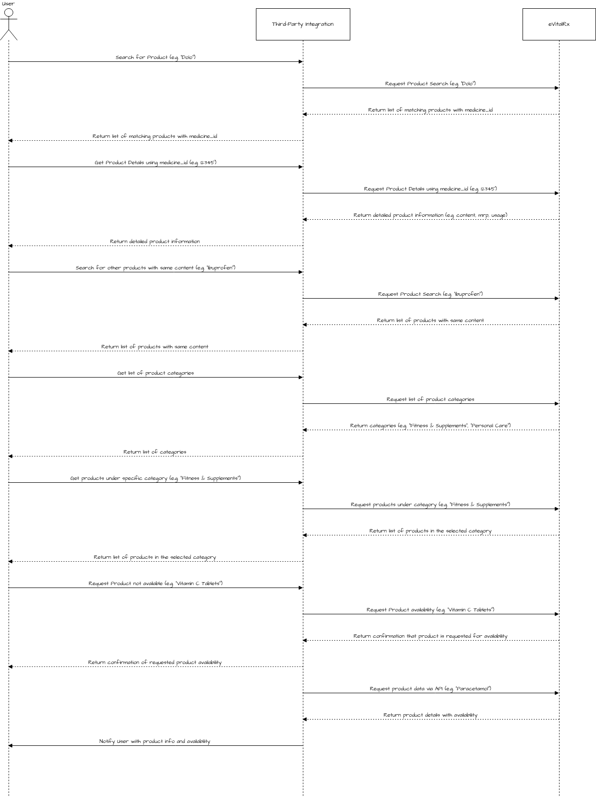

# Introduction

This bundle provides APIs for managing and retrieving product information, including searching for medicines, viewing product details, exploring categories, and requesting products. It helps to smooth the product catalog management.

**Here is the Postman Collection of APIs**



## Sequence Diagram

<figure><figcaption>
<mark style="background-color:yellow;"><strong><code>This flowchart illustrates the process of interacting with a product catalog API bundle. The user selects an action (such as searching for products, viewing product details, or browsing categories), and the system calls the corresponding API to fetch the relevant data. Once the API responds, the system returns the results to the user. This flow ensures efficient product catalog management by handling different user requests like searching, viewing, or requesting products.</code></strong></mark>
</figcaption></figure>

**Watch a video.**


